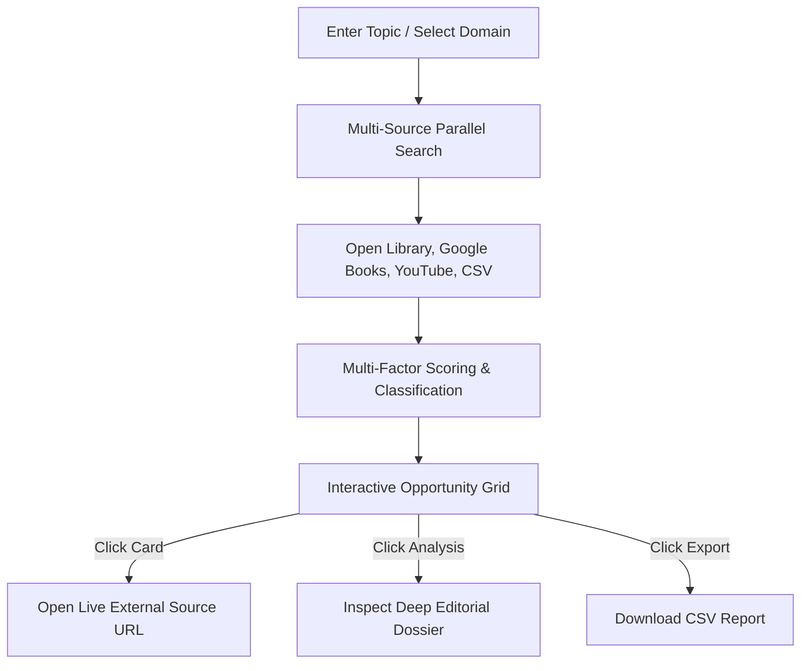

# PubIntel AI 🚀
### Enterprise Publishing Intelligence & Content Acquisition Platform

**PubIntel AI** is a state-of-the-art publishing intelligence and acquisition platform designed for book acquisition editors, commissioning directors, content strategists, and media executives. The platform continuously monitors, ingests, and analyzes multi-source digital content platforms—including **Open Library**, **Google Books**, **YouTube**, and custom CSV catalogs—to surface non-fiction book candidate topics, self-published ebooks, high-engagement video masterclasses, and expert creators with high print publishing potential.

---

## 📌 Executive Overview & Core Problem Solved

Traditional book commissioning often relies on manual research, anecdotal market trends, or delayed bestseller lists. **PubIntel AI** modernizes non-fiction acquisition by establishing an automated discovery pipeline that:

1. **Detects Unmet Demand**: Identifies surging online educational content (e.g. video series, open-source tutorials, self-published courses) in technical and professional domains before traditional publishers print books on them.
2. **Quantifies Publishing Viability**: Evaluates online content across multi-factor editorial algorithms (Opportunity Score, Book Potential Score, Competitive Gap Score, and Creator Authority Score).
3. **Streamlines Acquisition Workflows**: Provides 1-click access to original source content, creator profiles, contact pathways, and instant CSV export capabilities for editorial review boards.

---

## 🌟 Key Features & Platform Capabilities

### 🔍 Multi-Source Data Engine
- **Open Library Integration**: Queries 20+ live published book opportunities per search pass via Open Library's public REST APIs.
- **Google Books Integration**: Rate-resilient connector retrieving published titles, author metadata, ratings, and preview URLs.
- **YouTube Playlists & Masterclasses**: Monitors multi-part educational playlists, technical tutorials, and creator courses.
- **CSV Catalog Ingestion**: Allows editorial teams to upload proprietary spreadsheets, conference speaker lists, or custom datasets into the discovery pipeline.

### 📊 Multi-Factor Editorial Scoring System
Each discovered item is scored on a 0–100 normalized scale across key metrics:

| Score Metric | Weight | Description |
| :--- | :---: | :--- |
| **Opportunity Score** | 30% | Overall commercial publishing viability combining audience demand and competitive scarcity. |
| **Book Potential Score** | 25% | Curriculum depth, topic structure, and transcript feasibility for adapting digital content into a physical book. |
| **Competitive Gap Score** | 25% | Scarcity analysis measuring the lack of recent competing titles in traditional retail/library channels. |
| **Creator Authority Score** | 20% | Creator audience reach, subscriber loyalty, engagement rates, and cross-platform footprint. |

### 🎯 Direct External Source Access & Editorial Rationale
- **1-Click Source Redirection**: Clicking any opportunity card opens its live external source URL (e.g., YouTube playlist, Open Library work record, or Google Books preview).
- **Deep Analysis View**: Internal editorial dossier breakdown providing possible book angles, target audience personas, rights status, and contactability.

### 🌐 50+ Pre-Indexed Professional Domains
Pre-configured taxonomy covering emerging high-growth subjects:
- **Artificial Intelligence**: Agentic AI, Model Context Protocol (MCP), Autonomous Agents, Vector DBs & RAG.
- **Trading & Markets**: Algorithmic Trading with Python, Quantitative Finance, Backtesting.
- **Enterprise Software**: Salesforce Agentforce, n8n Open-Source Automation, Copilot Excel Modeling.
- **Creative Technology**: DaVinci Resolve AI Video Editing, AI Sound Design & Procedural Audio.

---

## 🛠️ Technology Stack & Architecture

- **Frontend Framework**: Next.js 14 (App Router, Client Components, Static Export)
- **Styling**: Tailwind CSS & Custom Design System (Dark Glassmorphism, Mesh Gradients)
- **Typography**: Google Fonts (*Outfit* headings & *Inter* body)
- **Icons**: Lucide React
- **Data Engine**: Client-side async search & scoring fallback engine (`clientSearch.ts`)
- **Export Utility**: Browser-based PapaParse CSV Generator (`csvExporter.ts`)
- **Automated QA**: Playwright Chromium Browser Test Suite (`test-ui.js`, `test-links.js`)
- **Deployment**: GitHub Pages Static Hosting (`output: 'export'`, `basePath: '/pubintel-ai'`, `.nojekyll`)

---

## 📖 User Workflow & Usage Guide



1. **Dashboard Investigation**: Enter a keyword (e.g., `Agentic AI` or `Algorithmic Trading`) or select from popular research chips.
2. **Filtering & Sorting**: Use the domain dropdown filter to isolate specific categories, or sort by Opportunity Score, Book Potential, or Creator Authority.
3. **Source Redirection**: Click on any card or the **Open Source ↗** button to view the original content on YouTube or Open Library.
4. **Editorial Evaluation**: Click **Analysis →** to view detailed publishing rationale, potential book titles, and creator contact paths.
5. **CSV Export**: Click **Export CSV** in the top navigation or grid header to download structured data for team review.

---

## 🚀 Local Development Setup

### Prerequisites
- **Node.js**: v18.0.0 or higher
- **npm**: v9.0.0 or higher

### Installation

1. **Clone the repository**:
   ```bash
   git clone https://github.com/dhurialokb2468/pubintel-ai.git
   cd pubintel-ai
   ```

2. **Install dependencies**:
   ```bash
   npm install
   ```

3. **Start local development server**:
   ```bash
   npm run dev
   ```
   Navigate to `http://localhost:3000` in your web browser.

4. **Build production static export**:
   ```bash
   npm run build
   ```
   The compiled static website will be generated in the `out/` directory.

---

## 🧪 Automated Testing & QA Audit

The repository includes pre-configured Playwright browser automation scripts to verify 100% page rendering and external link health:

```bash
# Run comprehensive 7-page visual and routing audit
node test-ui.js

# Run link health and external URL redirection test
node test-links.js
```
